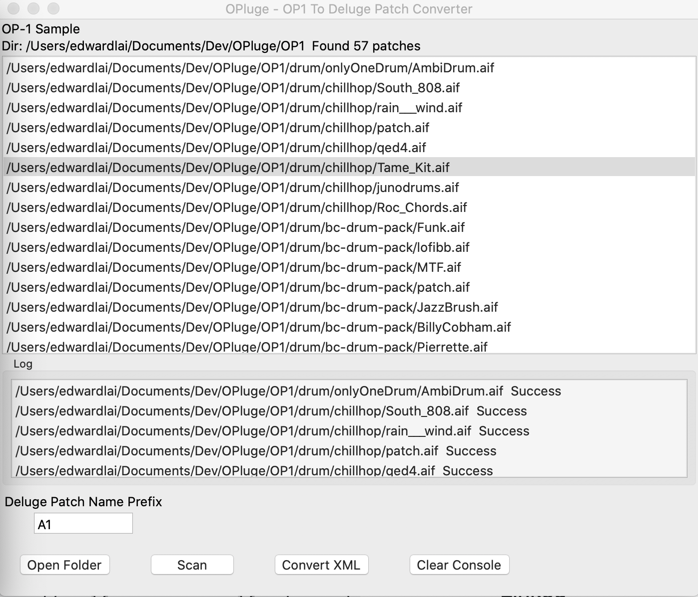
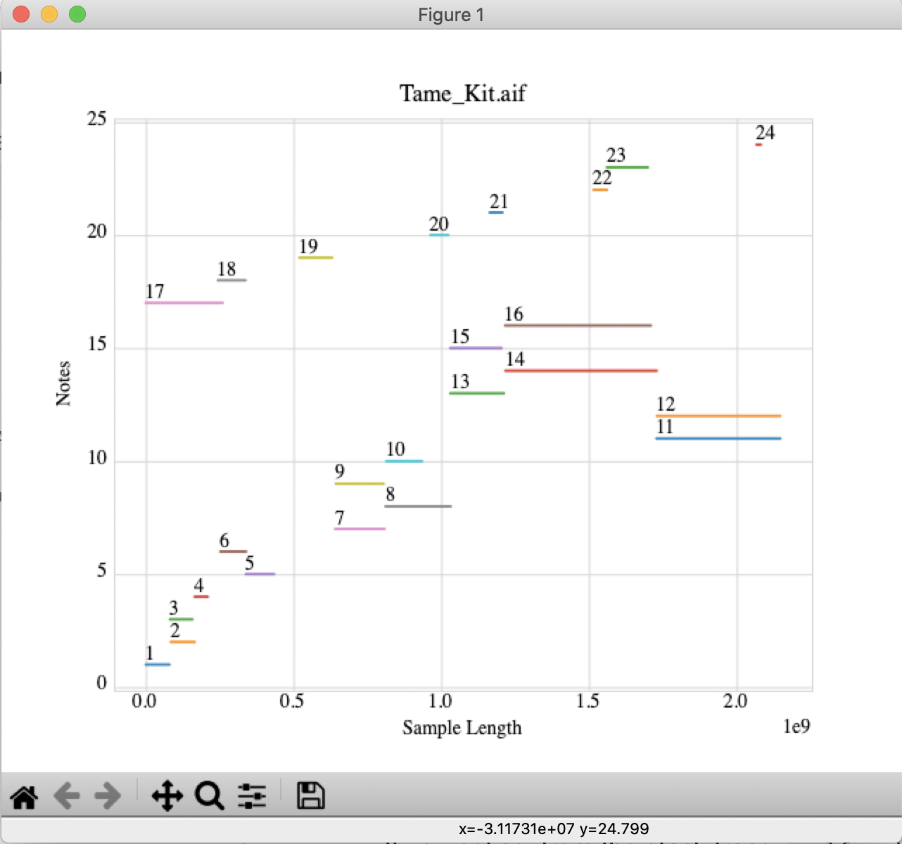

# OPluge    
### OP1 Patch/ Deluge XML Patch Converter  

  

## Introduction
OPluge is a sound patch converter built for Teenage Engineering OP-1 and Synthstorm Deluge. Feature abilities to convert OP-1's AIF patch format into Deluge's XML format. This converter converts AIF audio file into WAV into a 44100/16bit audio file. Meanwhile generating Deluge XML patch file that contains OP1's settings.
OP1 samples are vastly available online such as website `op1.fun`. Make use of those preexisted patches can be a great advantage for the Deluge users.
 

## Features
- Compatible to Deluge V3.0.1 firmware release   
- Automatically ignore patches other then OP-1 drum or sample engine.
- Search all the OP-1 patches from given selected directory 
- AIF to WAV audio file conversion
- Maximize sample rates up to 44.1 kHz/16bit
- Export Deluge friendly filing structure.
- Visualized sample chop graph.

## Translated OP1 Patch Settings  
##### OP1 Drum Engine -> Deluge Kit
- Drum sample chops (Start/End)
- Pitch mapped to Deluge's Transpose
- Play mode that can be Once, Cut, Loop
- Reverse Mode
- Volume of each sample chop
- Sample path generated in XML

##### OP1 Sampler Engine -> Deluge Synth
 - Sample Start/Endpoint
 - Sample Re-trig Start/Endpoint
 - ADSR (Attack, Decay, Sustain, and Release)
 - Play mode can be Poly, Mono, or Legato
 - Unison 
 - Portamento
 - Reverse Mode
 - Sample Volume
 
 
## Usage
Virtual environment is installed, running it should be fairly easy 
Use terminal and `cd` into this directory  
For Mac and Linux user run following script   
`sh run.sh`   
 For Windows users run following script   
`sh win_run.sh`  
If the following script does not work make sure python3 is installed properly, and `env` is pointed activated. Before calling `Sudo Python3 main.py`
- NOTE: `Sudo` with password access is required because of the Audio conversion and XML file generation.

 
## Convert your OP1 patches
In the user interface. There are two panels
and four buttons. It is really simple getting around.

The top console shows found OP1 patches. Also, a queue waiting to be converted into Deluge file
The bottom console shows the conversion status.

Four buttons:  
- `Open Folder`: Select a folder that contains OP1 patched. Nested folder is fine. It does not have to be organized or sorted. But still, I strongly recommend that each patch is inside a named pack name. Like how this OP1 is used to.  
- `Scan`: This scans and search for op1 patches
- `Convert XML`: Assign a place where you would want to save the exported files
- `Clear Console`: Clears both console
- `Prefix Naming`: If insert text like `A1 ` Then all the output patch names will have `A1` added as prefix. It will look like this `A1Patch1.XML`.
This is extremely useful as categorizing your Deluge patches. Since Deluge sorts when scrolling through patches. The name with prefix keeps the sample together.
Strongly suggest prefix like `A1`...`A12`, `B1`...`B12`...  It kinda acts like a bank. If empty, no prefix will be added. 

## Tool Visualization

After scanning patches, double click any item in the top console.
If the patch is a drum patch. It will then display a visualized graph
showing the sample chops.

## Generated Deluge File Structure
Once the application finishes exporting there will be a new folder saved accordingly.
The naming is something like `Deluge_Export_` and followed by `Date` and `Time` 
